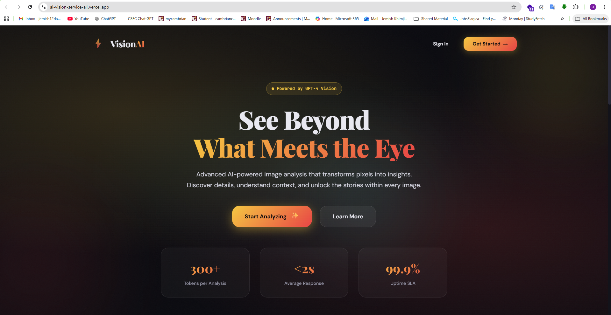

# AI Vision Analyzer

> Advanced AI-powered image analysis service with tiered access control

[](https://your-app.vercel.app)
[](https://nextjs.org/)
[](https://openai.com/)

## 📋 Table of Contents

- [Overview](#overview)
- [Features](#features)
- [Technologies Used](#technologies-used)
- [Live Demo](#live-demo)
- [Screenshots](#screenshots)
- [Getting Started](#getting-started)
- [API Documentation](#api-documentation)
- [Deployment](#deployment)
- [Project Structure](#project-structure)
- [Environment Variables](#environment-variables)
- [Known Limitations](#known-limitations)
- [Future Enhancements](#future-enhancements)
- [License](#license)

## 🎯 Overview

AI Vision Analyzer is a production-ready SaaS application that leverages OpenAI's GPT-4 Vision API to provide detailed, AI-generated descriptions of uploaded images. The application features professional user authentication, tiered access control, and a beautiful, modern user interface.

This project demonstrates:
- **Full-stack development** with Next.js and FastAPI
- **AI integration** using OpenAI's Vision API
- **Authentication & authorization** with Clerk
- **Serverless deployment** on Vercel
- **Production-grade** error handling and validation

## ✨ Features

### Core Features

- 🔐 **Secure Authentication**
  - Email, Google, and GitHub sign-in via Clerk
  - JWT-based API authentication
  - Protected routes and endpoints

- 🤖 **AI-Powered Image Analysis**
  - Advanced image descriptions using GPT-4o-mini Vision
  - Detailed object, color, mood, and composition analysis
  - Support for JPG, JPEG, PNG, and WEBP formats
  - Maximum file size: 5MB

- 📊 **Tiered Access Control**
  - **Free Tier**: 1 image analysis per session
  - **Premium Tier**: Unlimited analyses
  - Real-time usage tracking
  - Automatic limit enforcement

- 🎨 **Professional UI/UX**
  - Modern, responsive design with Tailwind CSS
  - Dark mode support
  - Smooth animations and transitions
  - Intuitive image upload with drag-and-drop
  - Real-time progress indicators

- 🛡️ **Robust Error Handling**
  - File type validation
  - File size validation
  - Clear error messages
  - Graceful API error handling

## 🛠️ Technologies Used

### Frontend
- **Next.js 14** - React framework with Pages Router
- **TypeScript** - Type-safe JavaScript
- **Clerk** - Authentication and user management
- **Tailwind CSS** - Utility-first CSS framework

### Backend
- **FastAPI** - Modern Python web framework
- **Pydantic** - Data validation
- **fastapi-clerk-auth** - JWT verification
- **OpenAI Python SDK** - Vision API integration

### AI & Services
- **OpenAI GPT-4o-mini Vision** - Image analysis
- **Clerk** - Authentication infrastructure
- **Vercel** - Deployment platform

### Development Tools
- **Git** - Version control
- **ESLint** - Code linting
- **Python 3.9+** - Backend runtime
- **Node.js 18+** - Frontend runtime

## 🚀 Live Demo

**Production URL:** [https://ai-vision-service-a1.vercel.app](https://ai-vision-service-a1.vercel.app)

### Test Credentials

You can create a free account using:
- Email sign-up
- Google authentication
- GitHub authentication

## 📸 Screenshots

### Landing Page

*Modern landing page with hero section, features, and pricing*

### Image Analysis

*AI-powered image analysis with detailed descriptions*

## 🏁 Getting Started

### Prerequisites

- **Node.js** 18.x or higher
- **Python** 3.9 or higher
- **OpenAI API Key** ([Get one here](https://platform.openai.com/api-keys))
- **Clerk Account** ([Sign up here](https://clerk.com))

### Installation

1. **Clone the repository**
   ```bash
   git clone https://github.com/your-username/ai-vision-analyzer.git
   cd ai-vision-analyzer
   ```

2. **Install Node.js dependencies**
   ```bash
   npm install
   ```

3. **Set up environment variables**
   
   Create a `.env.local` file in the root directory:
   ```bash
   # Clerk Authentication
   NEXT_PUBLIC_CLERK_PUBLISHABLE_KEY=pk_test_...
   CLERK_SECRET_KEY=sk_test_...
   CLERK_JWKS_URL=https://...clerk.accounts.dev/.well-known/jwks.json
   
   # OpenAI API
   OPENAI_API_KEY=sk-proj-...
   ```

4. **Run the development server**
   ```bash
   npm run dev
   ```

5. **Open your browser**
   
   Navigate to [http://localhost:3000](http://localhost:3000)

   > **Note:** The Python backend requires deployment to Vercel to function. For local testing, deploy to Vercel's preview environment using `vercel .`

### Getting API Keys

#### Clerk Setup

1. Go to [clerk.com](https://clerk.com) and create an account
2. Create a new application named "AI Vision Service"
3. Enable authentication methods: Email, Google, GitHub
4. Copy your keys from the dashboard:
   - Publishable Key (starts with `pk_`)
   - Secret Key (starts with `sk_`)
   - JWKS URL (in API Keys section)

#### OpenAI Setup

1. Go to [platform.openai.com](https://platform.openai.com)
2. Create an account and add billing ($5 minimum)
3. Navigate to API Keys section
4. Create a new secret key
5. Copy the key (starts with `sk-proj-`)

## 📚 API Documentation

### Base URL

- **Production:** `https://your-app.vercel.app/api`
- **Development:** `http://localhost:3000/api`

### Endpoints

#### Health Check

```http
GET /api/health
```

**Response:**
```json
{
  "status": "healthy",
  "service": "AI Vision Analyzer",
  "version": "1.0.0",
  "timestamp": "2026-02-13T12:00:00Z"
}
```

#### Get Usage Information

```http
GET /api/usage
```

**Headers:**
```
Authorization: Bearer <jwt_token>
```

**Response:**
```json
{
  "user_id": "user_2abc123",
  "tier": "free",
  "analyses_used": 1,
  "limit": 1,
  "remaining": 0,
  "history_count": 1
}
```

#### Analyze Image

```http
POST /api/analyze
```

**Headers:**
```
Authorization: Bearer <jwt_token>
Content-Type: multipart/form-data
```

**Body:**
- `file`: Image file (JPG, JPEG, PNG, WEBP, max 5MB)

**Success Response (200):**
```json
{
  "success": true,
  "description": "This image shows a beautiful sunset over the ocean with vibrant orange and pink hues...",
  "user_id": "user_2abc123",
  "tier": "free",
  "analyses_used": 1,
  "filename": "sunset.jpg",
  "timestamp": "2026-02-13T12:00:00Z",
  "tags": ["sunset", "ocean", "nature", "outdoor"]
}
```

**Error Responses:**

| Status Code | Description |
|-------------|-------------|
| 400 | Invalid file type |
| 413 | File too large (>5MB) |
| 429 | Usage limit exceeded |
| 500 | Internal server error |

**Example Error (429):**
```json
{
  "detail": {
    "error": "Usage limit exceeded",
    "message": "You've reached your free tier limit. Upgrade to Premium for unlimited analyses.",
    "tier": "free",
    "limit": 1
  }
}
```

## 🌐 Deployment

### Deploy to Vercel

1. **Install Vercel CLI**
   ```bash
   npm install -g vercel
   ```

2. **Login to Vercel**
   ```bash
   vercel login
   ```

3. **Deploy to preview**
   ```bash
   vercel .
   ```

4. **Add environment variables**
   ```bash
   vercel env add NEXT_PUBLIC_CLERK_PUBLISHABLE_KEY
   vercel env add CLERK_SECRET_KEY
   vercel env add CLERK_JWKS_URL
   vercel env add OPENAI_API_KEY
   ```
   
   Select "production", "preview", and "development" for all variables.

5. **Deploy to production**
   ```bash
   vercel --prod
   ```

### Vercel Configuration

The project includes a `vercel.json` configuration file:

```json
{
  "builds": [
    {
      "src": "api/index.py",
      "use": "@vercel/python"
    }
  ],
  "routes": [
    {
      "src": "/api/(.*)",
      "dest": "api/index.py"
    }
  ]
}
```

This configures:
- Python serverless functions for the FastAPI backend
- Route mapping for API endpoints

## 📁 Project Structure

```
ai-vision-analyzer/
├── api/
│   └── index.py              # FastAPI backend with all endpoints
├── pages/
│   ├── _app.tsx              # Next.js app wrapper with Clerk provider
│   ├── index.tsx             # Landing page
│   ├── analyze.tsx           # Image analysis page
│   └── upgrade.tsx           # Premium upgrade information page
├── public/                   # Static assets
├── screenshots/              # Project screenshots
├── .env.local               # Environment variables (not in git)
├── .gitignore               # Git ignore rules
├── next.config.js           # Next.js configuration
├── package.json             # Node.js dependencies
├── requirements.txt         # Python dependencies
├── tsconfig.json            # TypeScript configuration
├── vercel.json              # Vercel deployment configuration
└── README.md                # This file
```

## 🔐 Environment Variables

### Required Variables

| Variable | Description | Example |
|----------|-------------|---------|
| `NEXT_PUBLIC_CLERK_PUBLISHABLE_KEY` | Clerk publishable key (client-side) | `pk_test_...` |
| `CLERK_SECRET_KEY` | Clerk secret key (server-side) | `sk_test_...` |
| `CLERK_JWKS_URL` | Clerk JWKS endpoint for JWT verification | `https://.../.well-known/jwks.json` |
| `OPENAI_API_KEY` | OpenAI API key | `sk-proj-...` |

### Setting Variables

**Local Development:**
Create a `.env.local` file with all required variables.

**Vercel Production:**
```bash
vercel env add VARIABLE_NAME
```

## ⚠️ Known Limitations

### In-Memory Usage Tracking

The current implementation uses in-memory storage for usage tracking:

```python
usage_tracker: Dict[str, int] = {}  # Resets on deployment
```

**Implications:**
- Usage data resets when the serverless function cold-starts
- Not suitable for production at scale
- Free tier users may get more than 1 analysis across sessions

**Production Solution:**
For production deployment, implement persistent storage:
- PostgreSQL/MySQL database
- Redis for caching
- Vercel KV for serverless key-value storage

### Subscription Management

Premium access is currently granted via Clerk metadata:

```json
{
  "subscription": "premium",
  "tier": "premium"
}
```

**Production Enhancement:**
Integrate with payment providers:
- Stripe for subscription billing
- Clerk Billing for managed subscriptions
- Webhooks for automatic tier updates

### File Storage

Uploaded images are processed in-memory and not stored:
- Images are converted to base64
- Sent to OpenAI API
- Discarded after processing

**This is intentional for privacy**, but limits features like:
- Analysis history with thumbnails
- Re-analysis of previous images
- Image gallery

## 🚀 Future Enhancements

### Planned Features

- [ ] **Persistent Storage**
  - Database integration for usage tracking
  - Analysis history storage
  - User preferences

- [ ] **Payment Integration**
  - Stripe subscription management
  - Automated tier upgrades/downgrades
  - Invoice generation

- [ ] **Enhanced Analysis**
  - Batch image processing
  - Comparison between multiple images
  - Object detection with bounding boxes
  - OCR for text extraction

- [ ] **User Dashboard**
  - Analysis history with thumbnails
  - Usage analytics
  - Download analysis reports
  - API key management

- [ ] **Social Features**
  - Share analysis results
  - Public/private analysis galleries
  - Comments and discussions

## 🧪 Testing Premium Access

For demonstration and testing purposes, premium access can be granted manually:

1. Go to [Clerk Dashboard](https://dashboard.clerk.com)
2. Navigate to **Users** → Select user
3. Edit **Public metadata**
4. Add:
   ```json
   {
     "subscription": "premium",
     "tier": "premium"
   }
   ```
5. Save and have the user sign out/in

The user will now have unlimited access.

## 📄 License

This project is developed as part of the AIE1018 - AI Deployment and MLOps course at Cambrian College (Winter 2026).

## 👨‍💻 Author

**[Your Name]**  
Student ID: [Your Student ID]  
Cambrian College - AIE1018

## 🙏 Acknowledgments

- **OpenAI** for the GPT-4 Vision API
- **Clerk** for authentication infrastructure
- **Vercel** for hosting and deployment
- **Cambrian College** for the course curriculum
- **Course Instructor** for guidance and support

---

**Note:** This is a demonstration project for educational purposes. For production use, implement proper database storage, payment processing, and monitoring systems.

## 📞 Support

For issues or questions:
- Open an issue on GitHub
- Contact: [your.email@example.com]
- Course Forum: [Link if applicable]

---

Made with ❤️ using Next.js, FastAPI, and OpenAI